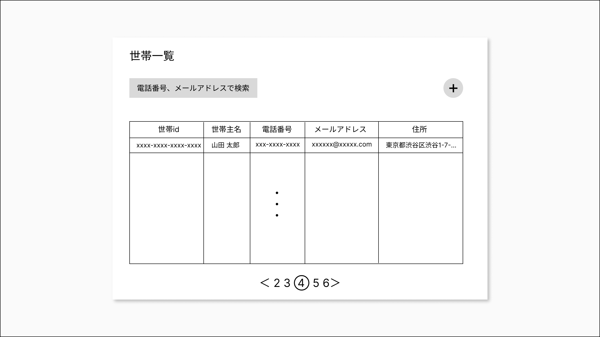
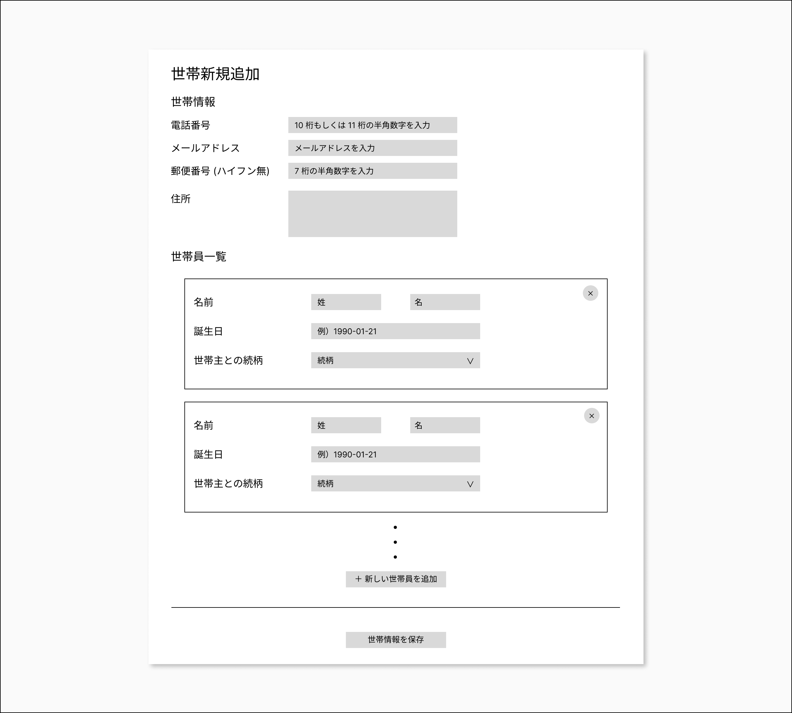
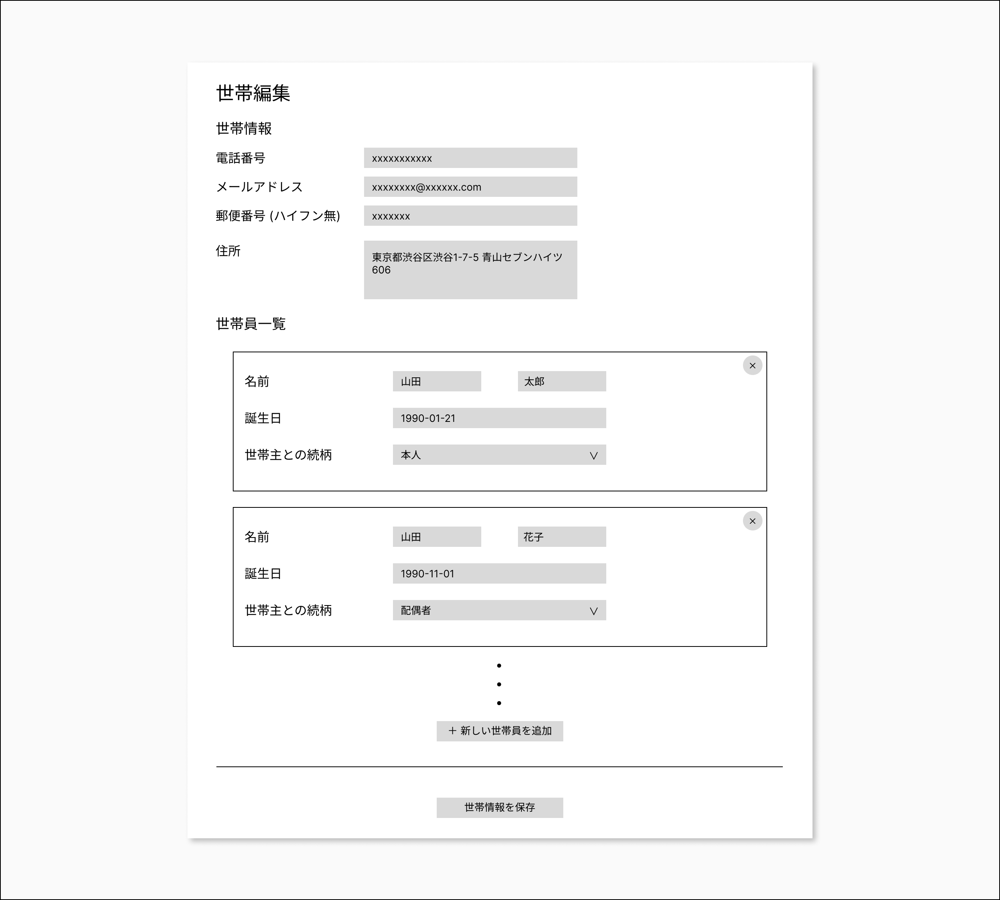

# coding-test-v1

## Setup

```bash
npm -g i pnpm # pnpm がインストールされていない場合

cd coding-test-v1
pnpm install
pnpm run dev
```

## 課題概要

- とある CRM における世帯および世帯員の管理ページを、要件定義 (後述) の機能を満たすよう実装してください。

### 採点基準

- バックエンドが存在する一般的な Web アプリケーションを構築できる能力
- 要件定義を満たす Web アプリケーションを構築できる能力
- 変更容易な設計およびコーディングが行える能力
- React、TypeScript 等の各ライブラリに対する理解度
- 第三者が振り返ることを考慮した適切なコミットの粒度
- など

### 使用技術

- TypeScriptおよびReactを用いて実装を行ってください。
- スタイリング方法は以下の中から選択してください。
  - CSS in JS
    - styled-components, emotion, linaria, など
  - vanilla-extract
  - Tailwind CSS
- スタイリングを行う際、モバイル端末等のマルチデバイス対応を行う必要はございません。
- ブラウザは最新版の Chrome を想定しています。
- 適宜外部ライブラリを追加していただいて構いません。
  - 追加したライブラリは、課題提出時にその導入理由を説明したドキュメントを添付してください。
- バックエンドへのリクエストはすべてモックサーバーを用いて実装してください。
  - エンドポイントは Mock Service Worker を使ってモックしています。
  - エンドポイントの仕様は、同梱されている openapi.yaml をご参照ください。

### 提出方法

以下のファイルを zip に圧縮し、担当者にメール等で送付してください。

- 実装したソースコード
- 実装したソースコードのディレクトリ構成や、各ディレクトリの役割などの設計を簡単に説明したドキュメント
- （外部ライブラリを追加した場合）追加したライブラリとその導入理由を説明したドキュメント

締め切り: **課題開始から 14 日後の 23:59 まで**

※ 実装の途中であったとしても、完成したところまでで提出してください。  
※ **締め切りまでに課題の提出されなかった場合は、不採用となりますのご注意ください。**

## 要件定義

下記の画像のワイヤーフレームは、あくまでページの構成やレイアウトを確認するためのもののため、ワイヤーフレームの通りにデザインを実装する必要はありません。  
ある程度ワイヤーフレームに沿ったレイアウトになるように実装し、その他のデザインは実装者の裁量に任せます。

主な機能は以下の通りです。

- 世帯の一覧の閲覧
- 世帯の追加・取得・変更
- 世帯員の追加・取得・変更・削除

### 世帯一覧ページ



#### 概要

- DB に保存されている世帯と世帯主を一覧で表示するページ
- url: /households

#### 機能

##### 世帯一覧の閲覧

- 以下の項目が閲覧できるテーブルの作成
  - 世帯 id (households.uid)
    - 世帯の uid をクリックすることで、その世帯の詳細ページへと遷移する
  - 世帯主名
  - 電話番号
  - email
  - 郵便番号
  - 住所
- 1 度に表示できる最大の世帯数は 20 件とする (ページネーションにて詳細を後述)

##### 世帯一覧の検索

- 以下の項目で検索ができる
  - 電話番号、email
    - placeholder: 電話番号、メールアドレスで検索
    - 初期値: (空)
- フォームのフォーカスが外れたとき、または Enter キーが押されたときに検索を実行する
- 検索後のページ数は 1 とする
- 1 件も検索結果がない場合は、テーブルのコンテンツに「該当する世帯はありません。」と表示する

##### ページネーション

- 1 度に表示できる最大の世帯数は 20 件とする
- 次のページボタンをクリックすることで、次の 20 件の世帯を表示する
- 前のページボタンをクリックすることで、前の 20 件の世帯を表示する
- 1 ページ目の場合、前のページボタンは表示しない
- 最終ページの場合、次のページボタンは表示しない
- ページ数をクリックしたときに、そのページの世帯を表示する
- 1 つのページに表示できる最大のページ数は 5 とする
  - 例 (最終ページを 20 とする)
    - 現在のページが 1 ページ目の場合 → 1, 2, 3, 4, 5
    - 現在のページが 10 ページ目の場合 → 8, 9, 10, 11, 12
    - 現在のページが 19 ページ目の場合 → 16, 17, 18, 19, 20

##### 世帯新規追加ページへの遷移

- 世帯新規追加ボタンをクリックすると、世帯新規追加ページへと遷移する

### 世帯新規追加ページ



#### 概要

- 世帯を新規追加するページ
- url: /households/new

#### 機能

##### 世帯情報の入力

- 以下の項目が入力できるフォームを作成する
  - 電話番号 (ハイフン無)
    - 形式: テキストボックス
    - placeholder: 10 桁もしくは 11 桁の半角数字を入力
    - 初期値: (空)
    - 入力条件: 10 桁もしくは 11 桁の半角数字
    - 入力条件を満たしていない場合のエラーメッセージ: 10 桁もしくは 11 桁の半角数字を入力してください
  - メールアドレス
    - 形式: テキストボックス
    - placeholder: メールアドレスを入力
    - 初期値: (空)
    - 入力条件: `^[a-zA-Z0-9_.+-]+@[a-zA-Z0-9-]+\.[a-zA-Z0-9-.]+$` に従っている
    - 入力条件を満たしていない場合のエラーメッセージ: メールアドレスの形式で入力してください
  - 郵便番号 (ハイフン無)
    - 形式: テキストボックス
    - placeholder: 7 桁の半角数字を入力
    - 初期値: (空)
    - 入力条件: 7 桁の半角数字
    - 入力条件を満たしていない場合のエラーメッセージ: 7 桁の半角数字を入力してください
  - 住所
    - 形式: テキストエリア
    - 初期値: (空)
    - 入力条件: 1 文字以上
    - 入力条件を満たしていない場合のエラーメッセージ: 住所を入力してください
- 各インプットのフォーカスが外れたときに入力条件を満たしていない項目がある場合、その項目の下にエラーメッセージを表示する
- エラーメッセージが表示されている場合は、世帯の作成ボタンを押しても世帯は作成されない

##### 世帯員情報の追加・入力・削除

- 「世帯員を追加」ボタンを押すことで、世帯員情報の入力フォームが追加される
- 以下の項目が入力できるフォームを作成する (すべて必須項目)
  - 姓
    - 形式: テキストボックス
    - placeholder: 姓
    - 初期値: (空)
    - 入力条件: 1 文字以上
    - 入力条件を満たしていない場合のエラーメッセージ: 姓を入力してください
  - 名
    - 形式: テキストボックス
    - placeholder: 名
    - 初期値: (空)
    - 入力条件: 1 文字以上
    - 入力条件を満たしていない場合のエラーメッセージ: 名を入力してください
  - 誕生日
    - 形式: テキストボックス
    - placeholder: 例）1990-01-21
    - 初期値: (空)
    - 入力条件: Date オブジェクトが解釈できる (Invalid Date を返さない) 形式の文字列
    - 入力条件を満たしていない場合のエラーメッセージ: 誕生日を正しく入力してください
  - 世帯主との続柄
    - 形式: セレクター
    - 初期値: (未選択)
    - 入力条件: 以下のいずれかの値
      - 本人
      - 配偶者
      - 子
      - 父
      - 母
      - 兄
      - 弟
      - 姉
      - 妹
      - 義父
      - 義母
      - 義兄
      - 義弟
      - 義姉
      - 義妹
      - 孫
      - ひ孫
      - おじ
      - おば
      - いとこ
      - 祖父
      - 祖母
      - 曽祖父
      - 曽祖母
      - 姪
      - 甥
      - その他
    - 入力条件を満たしていない場合のエラーメッセージ: この項目は必須です
- 各インプットのフォーカスが外れたときに入力条件を満たしていない項目がある場合、その項目の下にエラーメッセージを表示する
- エラーメッセージが表示されている場合は、世帯の作成ボタンを押しても世帯は作成されない
- 世帯主が存在しない場合、世帯の作成ボタンを押しても世帯は作成されない
- 「削除」ボタンを押すと、ブラウザ標準の confirm が表示される
  - confirm のメッセージ
    - 姓名が入力されている場合: ○○ ○○ さんを削除しますか？
    - 姓名が入力されていない場合: この世帯員情報を削除しますか？
  - OK を押した場合
    - その世帯員情報が削除される
  - キャンセルを押した場合
    - なにもしない

##### 世帯員情報の保存

- 世帯の作成ボタンを押すことで、入力された世帯情報および世帯員情報が保存される

### 世帯編集ページ



#### 概要

- 選択した世帯や世帯員情報を編集するページ
- url: /households/:householdUid

#### 機能

- 機能・UI ともに「世帯新規追加ページ」と同様
- 各フォームの初期値が、選択した世帯や世帯員情報の値となる
- 新規に世帯員を追加した場合の初期値は、世帯新規追加ページと同様
